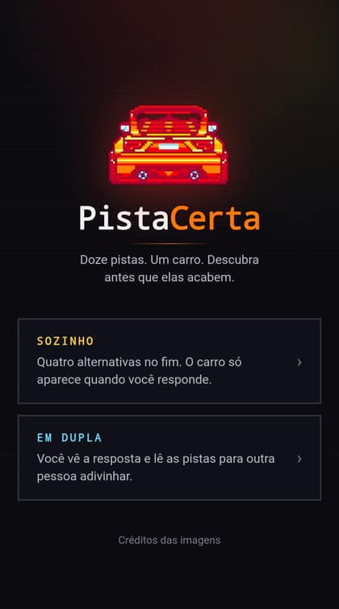
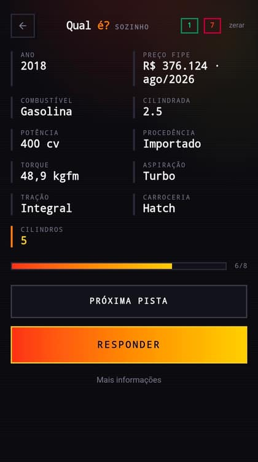
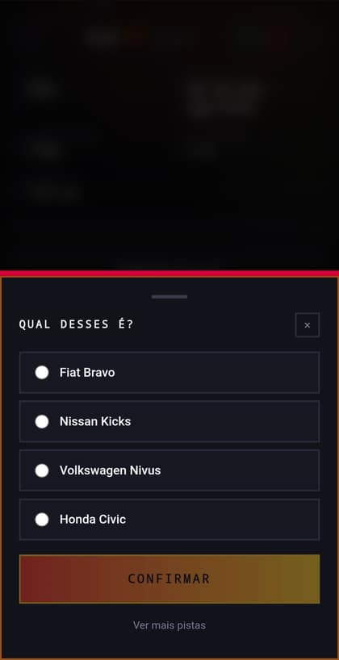
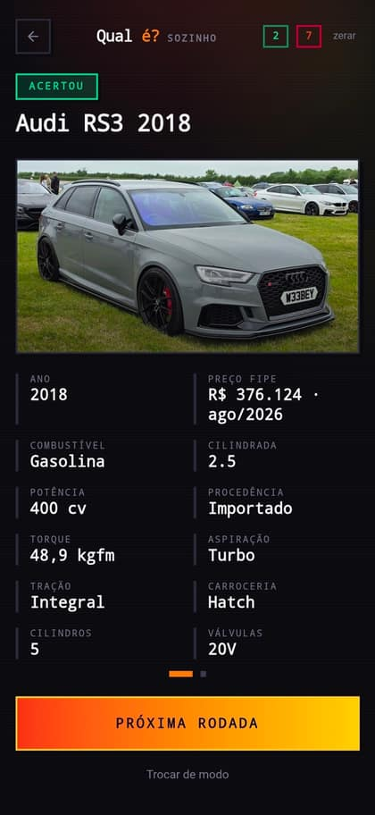
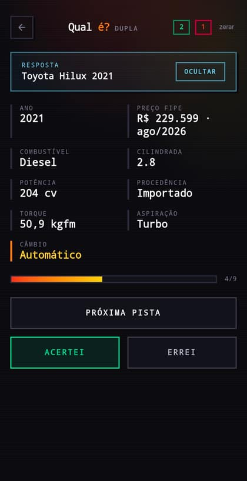

<div align="center">

# PistaCerta

**Jogo de adivinhação de veículos. Pistas progressivas, um carro, um caminhão — ou uma moto.**

[**jogar →**](https://pistacerta.br1ansouza.workers.dev)

[](https://react.dev)
[](https://www.typescriptlang.org)
[](https://rsbuild.rs)
[](https://tailwindcss.com)
[](https://bun.sh)
[](https://workers.cloudflare.com)

</div>

O sistema sorteia um veículo e mostra cinco pistas: ano, preço FIPE, combustível, cilindrada e potência. A cada clique vem mais uma — procedência, torque, motor, aspiração, câmbio, tração, carroceria e arranjo dos cilindros. Quanto antes você acertar, melhor.

Três categorias, com baralhos separados: **98 carros**, **52 caminhões** e **27 motos**, todos com presença real no Brasil ou na América do Sul. Os ícones no canto superior direito trocam de garagem.

Nos caminhões as pistas mudam de acordo: trações disponíveis (4x2, 4x4, 6x2, 6x4, 8x2, 8x4), PBT, PBTC e as cabines disponíveis.

Nas motos entra também o estilo — custom, café racer, big trail, speed, naked, clássica, trail ou urbana — além de ciclo do motor, refrigeração, transmissão final, peso, altura do banco e ABS.

## Como joga

<table>
  <tr>
    <td align="center" width="33%">
      <br />
      <sub><b>Escolha o modo</b><br />Sozinho ou em dupla</sub>
    </td>
    <td align="center" width="33%">
      <br />
      <sub><b>As pistas</b><br />Cinco de saída, o resto sob demanda</sub>
    </td>
    <td align="center" width="33%">
      <br />
      <sub><b>O palpite</b><br />Quatro alternativas, uma chance</sub>
    </td>
  </tr>
  <tr>
    <td align="center">
      <br />
      <sub><b>A revelação</b><br />Foto e ficha completa</sub>
    </td>
    <td align="center">
      <br />
      <sub><b>Em dupla</b><br />Você conduz, o outro adivinha</sub>
    </td>
    <td align="center">
      <br />
      <sub><b>Em movimento</b><br />Uma rodada do começo ao fim</sub>
    </td>
  </tr>
</table>

## Nunca repete veículo

O sorteio é um baralho, não um dado. Um veículo só volta a aparecer depois que todos os outros da categoria já apareceram — e o baralho vive num cookie assinado pelo servidor, então sobrevive a recarregar a página, minimizar o navegador no celular e até a um bundle velho em cache.

## Os dois modos

**Sozinho** — quatro alternativas e um botão Responder. O veículo fica escondido até você responder, e quem decide se acertou é o servidor.

**Em dupla** — você vê a resposta, atrás de um botão Revelar, e conduz a rodada lendo as pistas para outra pessoa. Aqui o Acertei/Errei faz sentido: tem alguém do outro lado para validar o palpite.

Placar de acertos e erros por modo, guardado no navegador.

## O veículo fica realmente escondido

Um app estático entrega tudo que sabe assim que a página carrega — daria para ler a resposta no F12 antes da primeira pista. Aqui não: a identidade do veículo não sai do servidor até você responder.

O que trafega é uma projeção sem marca, modelo, geração e imagem, e um token cifrado com AES-GCM que carrega o veículo da rodada. Decodificar o token à força devolve binário, adulterar devolve 401, e nenhum nome de veículo aparece no bundle.

## Rodando

```bash
bun install
bun run dev
```

Sobe a API em `127.0.0.1:3001` e o front em `0.0.0.0:3000`.

```bash
bun run typecheck        # tsc (TypeScript 7 nativo)
bun run lint             # oxlint
bun run build
bun run validate:content # schema e regras de curadoria do catálogo
bun run refresh:fipe     # reconsulta os preços salvos
bun run deploy           # publica no Cloudflare Workers
```

## Os dados

Cada veículo é um JSON em `content/vehicles/cars/`, `content/vehicles/trucks/` ou `content/vehicles/motorcycles/`. Preço e identificação vêm da tabela FIPE; torque, potência e código do motor não existem lá, então foram pesquisados um a um em fabricantes e publicações especializadas. A fonte e o link consultado ficam registrados em `specSource` e `specSourceUrl`.

**Campo sem fonte confiável fica ausente**, e o motor de pistas pula a pista correspondente em silêncio. Nunca aparece "não informado", e nada é inventado para preencher buraco. Carro que não junta pistas suficientes fica inativo em vez de render uma rodada curta.

As fotos ficam em `content/images.json`, quase todas apontando para o Wikimedia Commons ou Flickr sob licença livre. Cada uma declara `market` (`br` ou `global`) e `depicts` — o que a imagem mostra de verdade —, e o validador reprova veículo ativo sem foto conferida. Foi assim que caíram um Escort RS Cosworth europeu passando por XR3 e um Camaro 1969 no lugar do SS 2018.

As fotos de caminhões e motos priorizam URLs HTTPS externas. A Hunter 350 usa uma foto brasileira cedida para o jogo e hospedada em `public/vehicles/`; dois carros sem foto externa adequada também usam imagens de imprensa locais, sempre com autor e origem registrados.

## Arquitetura

`src/domain/` não conhece React e é importado tanto pelo cliente quanto pelo worker — as regras do jogo vivem num lugar só.

`Vehicle` é uma união discriminada por `kind`, e o motor de pistas é genérico sobre a lista de definições. Carros, caminhões e motos têm schema, pistas e diretórios de conteúdo próprios sem duplicar a experiência do jogo.

Sem banco de dados. As rotas são handlers `(Request) => Response` sem estado — rodam no `Bun.serve` local, no Cloudflare Workers em produção, e em qualquer outro provedor serverless sem reescrita. O baralho de cada categoria viaja cifrado no cookie, então nem o histórico precisa de estado no servidor.
