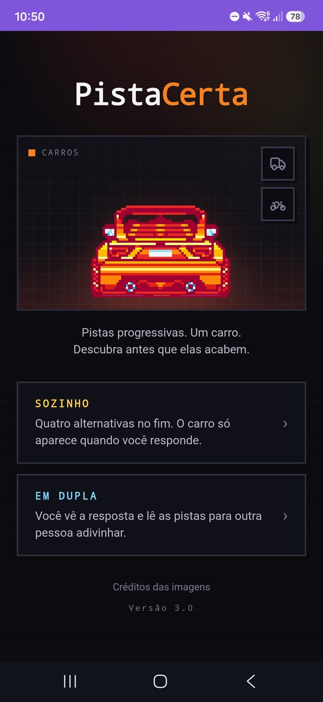
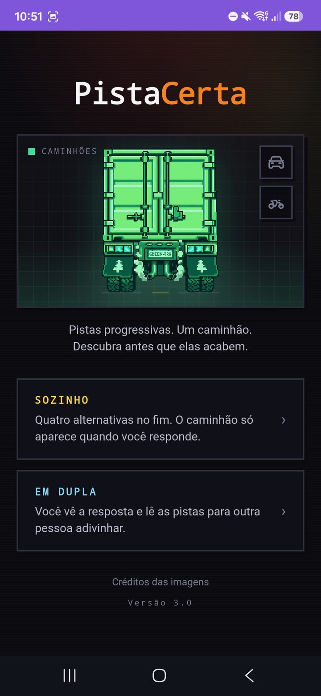
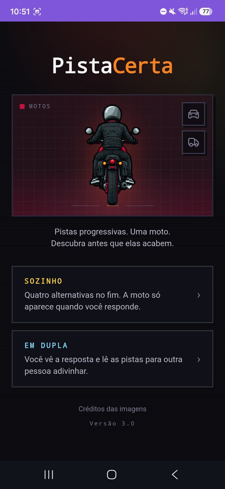
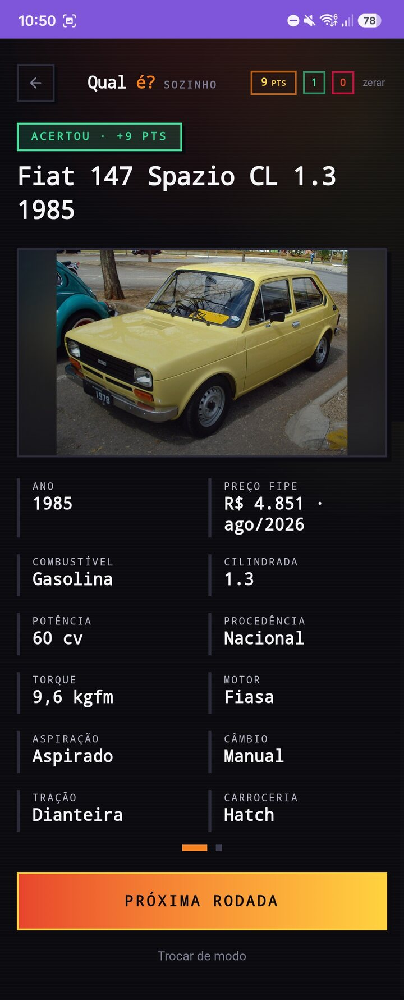
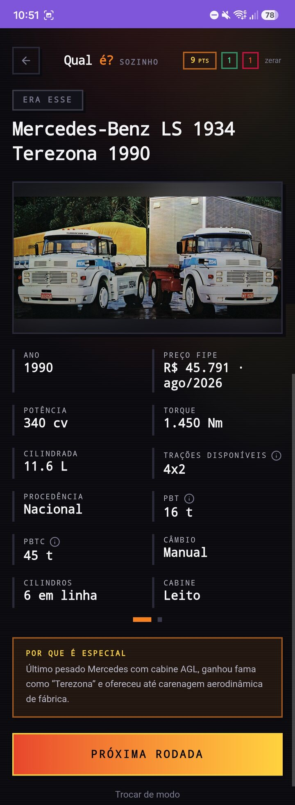
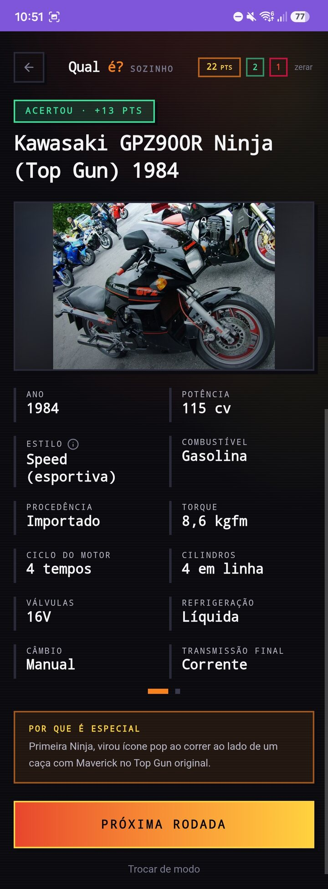
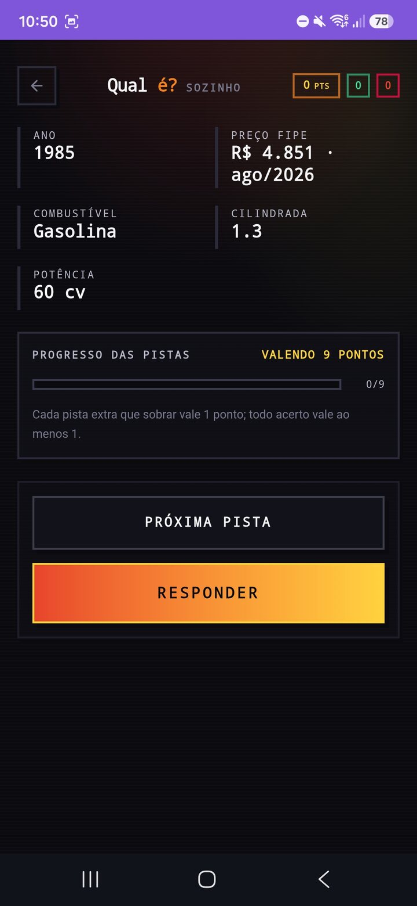
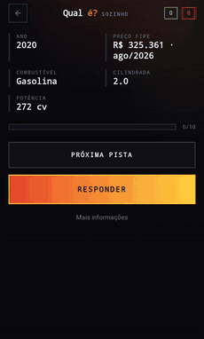

<div align="center">

# PistaCerta

**Jogo de adivinhação de carros, caminhões e motos com pistas progressivas.**

[**jogar →**](https://pistacerta.br1ansouza.workers.dev)

[](https://react.dev)
[](https://www.typescriptlang.org)
[](https://rsbuild.rs)
[](https://tailwindcss.com)
[](https://bun.sh)
[](https://workers.cloudflare.com)

</div>

O jogo sorteia um veículo e mostra até cinco pistas iniciais. Cada pista extra reduz a pontuação da rodada.

O catálogo tem **177 veículos ativos**: **98 carros**, **52 caminhões** e **27 motos**. Cada categoria tem seu próprio baralho e suas próprias pistas.

## A interface

<table>
  <tr>
    <td align="center" width="33%">
      <br />
      <sub><b>Carros</b><br />98 modelos no baralho</sub>
    </td>
    <td align="center" width="33%">
      <br />
      <sub><b>Caminhões</b><br />52 modelos no baralho</sub>
    </td>
    <td align="center" width="33%">
      <br />
      <sub><b>Motos</b><br />27 modelos no baralho</sub>
    </td>
  </tr>
  <tr>
    <td align="center">
      <br />
      <sub><b>Carro revelado</b><br />Resposta e ficha completa</sub>
    </td>
    <td align="center">
      <br />
      <sub><b>Caminhão revelado</b><br />Resposta e ficha completa</sub>
    </td>
    <td align="center">
      <br />
      <sub><b>Moto revelada</b><br />Resposta e ficha completa</sub>
    </td>
  </tr>
</table>

<table>
  <tr>
    <td align="center" width="50%">
      <br />
      <sub><b>Pistas progressivas</b><br />Cada pista extra reduz em um ponto o valor da rodada</sub>
    </td>
    <td align="center" width="50%">
      <br />
      <sub><b>Uma rodada completa</b><br />Da primeira pista à revelação</sub>
    </td>
  </tr>
</table>

## Como jogar

1. Escolha a categoria.
2. Selecione **Sozinho** ou **Em dupla**.
3. Revele pistas até saber a resposta.
4. Responda e confira a ficha do veículo.

No modo **Sozinho**, há quatro alternativas e o servidor confere a escolha. No modo **Em dupla**, quem conduz revela a resposta e lê as pistas para outra pessoa.

Um acerto vale o número de pistas progressivas que restavam, com o mínimo de um ponto. Pontos, acertos e erros ficam salvos no navegador, separados por modo.

## Pistas por categoria

| Categoria     | Pistas iniciais                                     | Outras pistas possíveis                                                                                                                             |
| ------------- | --------------------------------------------------- | --------------------------------------------------------------------------------------------------------------------------------------------------- |
| **Carros**    | ano, preço FIPE, combustível, cilindrada e potência | procedência, torque, motor, aspiração, câmbio, tração, carroceria, cilindros, portas e válvulas                                                     |
| **Caminhões** | ano, preço FIPE, potência, torque e cilindrada      | trações disponíveis, procedência, PBT, PBTC, câmbio, cilindros, cabine, aspiração e motor                                                           |
| **Motos**     | ano, preço FIPE, potência, estilo e combustível     | procedência, torque, ciclo do motor, cilindros, válvulas, refrigeração, câmbio, transmissão final, peso, altura do assento, ABS, cilindrada e motor |

Campos sem fonte confiável não aparecem na rodada.

## Baralho sem repetição

Um veículo só volta depois que os outros da categoria aparecerem. Quando o baralho recomeça, os oito veículos mais recentes continuam de fora nas primeiras rodadas.

O histórico de cada categoria fica salvo no navegador. Na versão online, uma cópia cifrada também fica em cookie.

## A resposta fica no servidor

Na versão online, o navegador recebe apenas os campos usados nas pistas. No modo Sozinho, marca, modelo, versão e imagem só saem do Cloudflare Worker depois da resposta.

Os tokens de rodada e de baralho usam **AES-GCM**. O servidor não guarda sessão ou histórico em banco de dados.

O fallback do GitHub Pages roda todo o catálogo no cliente e não oferece a mesma proteção contra inspeção.

## Os dados

Cada veículo é um JSON em `content/vehicles/cars/`, `content/vehicles/trucks/` ou `content/vehicles/motorcycles/`. A identificação e os preços vêm da tabela FIPE. As outras especificações são pesquisadas em fabricantes e publicações especializadas. A fonte fica registrada em `specSource` e `specSourceUrl`.

As imagens e seus créditos ficam em `content/images.json`. Cada registro informa mercado, conteúdo da foto, autor, licença e origem quando esses dados existem. O validador reprova veículos ativos sem imagem conferida.

As fotos de carros e caminhões usam URLs HTTPS externas. As 27 motos usam arquivos WebP em `public/vehicles/`. Os créditos também podem ser consultados no jogo.

## Rodando localmente

Requer [Bun](https://bun.sh).

```bash
bun install
bun run dev
```

A API sobe em `127.0.0.1:3001` e o frontend em `0.0.0.0:3000`.

```bash
bun run typecheck        # TypeScript 7 nativo
bun run lint             # oxlint
bun run format:check     # Prettier sem alterar arquivos
bun run build
bun run validate:content # schema, imagens e regras de curadoria
bun run refresh:fipe     # atualiza os preços FIPE salvos
bun run deploy           # build e deploy no Cloudflare Workers
```

## Arquitetura

As regras ficam em `src/domain/` e são usadas pelo cliente, pela API local e pelo Worker. `Vehicle` é uma união discriminada por `kind`, com schema e pistas próprios para cada categoria.

Não há banco de dados. Em produção, o estado necessário viaja cifrado entre o navegador e o Cloudflare Worker. O frontend é responsivo e instalável como PWA.
